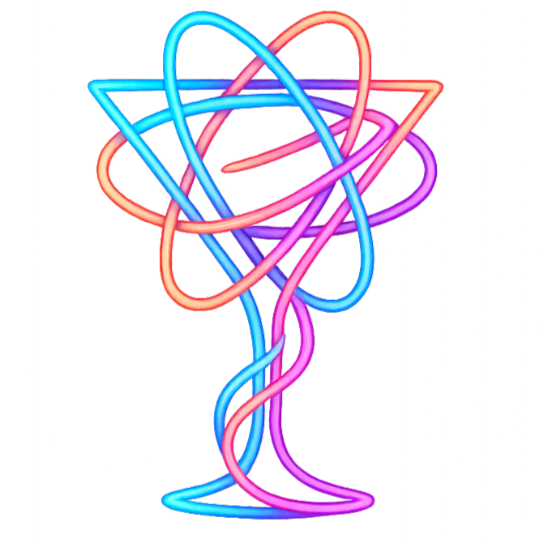

<div align="center">
  
  <h1>🍸 Cocktailia 🍸</h1>
  <p><strong>Because your browser deserves a drink.</strong></p>

  <p>
    
    
    
    
  </p>
</div>

---

## Yo! Welcome to the Party

Welcome to **Cocktailia**! 🥂 This isn't just a landing page; it's a whole *mood*. We took a blank screen, added some premium code spirits, and shook it until the animations came out looking smoother than a fresh Mojito on a Friday night. 

We're running on the bleeding edge here, folks! **React 19**? You bet. **Tailwind v4**? Oh, we fancy. **GSAP**? It's doing more gymnastics than an Olympian to make those text reveals pop! 🤸

## The Secret Sauce (Tech Stack)

Here is what we threw into the blender:

* **React 19:** Because we like our DOM virtual and our updates snappy.
* **Vite:** Fast? It's faster than me leaving work on a Friday.
* **Tailwind CSS v4:** Styling so easy it feels like cheating. (It’s not, it’s just *efficient*).
* **GSAP (ScrollTrigger & SplitText):** The real MVP. Making things fly, fade, and spin while you scroll.
* **Custom Vibes:** "Modern Negra" fonts and some grainy noise textures because we love that retro-aesthetic life.

## Features that Pop

* **Parallax Everything:** Leaves floating around like they own the place. 
* **Video Backgrounds:** Because static images are *so* 2023. 
* **Interactive Menu:** A spinny-wheel thingy to choose your poison. It's oddly satisfying to click. 
* **Responsive:** Looks good on your giant monitor AND your cracked iPhone screen. 

## How to Cook This Up (Installation)

Ready to play bartender? grab your terminal and let's mix this up!

1.  **Steal... I mean, Clone the repo:**
    ```bash
    git clone https://github.com/SieGer05/cocktailia-react.git
    cd cocktailia-react
    ```

2.  **Get the ingredients (Install dependencies):**
    ```bash
    npm install
    # Wait for the internet to do its thing... 
    ```

3.  **Open the Bar (Run Dev Server):**
    ```bash
    npm run dev
    # Boom! Localhost is now the coolest place in town.
    ```

4.  **Ship it (Build for Production):**
    ```bash
    npm run build
    # Now you're ready for the world! 
    ```

## Where's the stuff?

* `src/components`: Where the magic happens (Hero, About, that cool Menu).
* `src/index.css`: Where Tailwind v4 lives (RIP massive CSS files).
* `public/images`: The visual goodies. Don't drink the PNGs. 

## The Bill (License)

Open source, baby! MIT License. Take it, break it, remake it. Just don't blame me if you get too addicted to GSAP animations. 

---

<div align="center">
  <p>Made with ❤️, ☕
  <p><em>Please code responsibly.</em> 🥴</p>
</div>